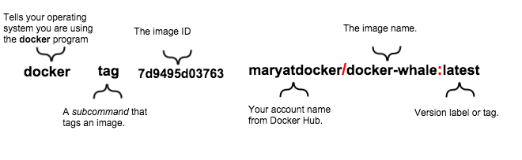

# Install

* Ref: [Install Docker Engine On CentOS](https://docs.docker.com/engine/installation/linux/centos/)

# Get Started
## Prerequisites

* Docker requires a *64-bit* installation regardless of your CentOS version.
* Your kernel must be 3.10 at minimum, which CentOS 7 runs.
    * To check your current kernel version
        ```
            $ uname -r
            3.10.0-229.el7.x86_64
        ```

* It is recommended that you fully update your system.
        
## Install

### Install with yum

* Make sure your existing yum packages are up-to-date.
    `$ sudo yum update`
    
* If not work and then dd the yum repo
    * `# vi /etc/yum.repo.d/docker.repo`
    ```
        [dockerrepo]
        name=Docker Repository
        baseurl=https://yum.dockerproject.org/repo/main/centos/$releasever/
        enabled=1
        gpgcheck=1
        gpgkey=https://yum.dockerproject.org/gpg    
    ```
    
* Install the Docker package.
    * `sudo yum install docker-engine`

* Start the Docker daemon
    * `sudo service docker start`
    
* Verify docker is installed correctly by running a test image in a container.
    * `sudo docker run hello-world`

### Install with the script    

## Create a docker group

* The *docker* daemon binds to a Unix socket instead of a TCP port.
    * By default that Unix socket is owned by the user *root* and other users can access it with *sudo* . For this reason, *docker* daemon always runs as the *root* user.
    
* To avoid having to use *sudo* when you use the *docker* command, create a Unix group called *docker* and add users to it. When the *docker* daemon starts, it makes the ownership of the Unix socket read/writable by the *docker* group.

* To create the docker group and add your user:
    1. Create the docker group and add your user.
        * `sudo usermod -aG docker your_username`
    2. Log out and log back in
        * This ensures your user is running with the correct permissions.
    3. Verify your work by running *docker* without *sudo* .
        * `$ docker run hello-world`
        
## Start the docker daemon at boot

* To ensure Docker starts when you boot your system, do the following:
    * `sudo chkconfig docker on`
    * Maybe you need run this command: `$ sudo systemctl list-unit-files`
    
## Uninstall with yum

1. List the package you have installed.
    * 
    ```
        $ yum list installed | grep docker
        yum list installed | grep docker
        docker-engine.x86_64   1.7.1-1.el7 @/docker-engine-1.7.1-1.el7.x86_64.rpm        
    ```
    
2. Remove the package
    * `sudo yum -y remove docker-engine.x86_64`
    * This command does not remove images, containers, volumes, or user-created configuration files on your host.
    
3. To delete all images, containers, and volumes, run the following command:
    * `$ rm -rf /var/lib/docker`
    
4. Locate and delete any user-created configuration files.

# Docker tutorials for linux

## Find and run the whalesay image (a test image)
    [Find and run the whalesay image](https://docs.docker.com/linux/step_three/)
1. Locate the whalesay image
    * Locate [Docker Hub](https://hub.docker.com)
    * Enter the word *whalesay* in the search bar
    * Click on the *docker/whalesay* image in the results and find the *repository* for the *whalesay* image.
2. Run the whalesay image
    * `$ docker run docker/whalesay cowsay boo`
        * The first time you run a software image, the *docker* command looks for it on your local system.
        * If the image isn't there, then *docker* gets it from the hub.
    * `$ docker images` :
        * List all the images on your local system.
    * `$ docker run docker/whalesay cowsay boo-boo`
    * `$ docker run docker/whalesay cowsay hdfj-adf-boo`

## Build your own image
    
    [Build your own image](https://docs.docker.com/linux/step_four/)
1. Write a Dockerfile
    * A Dockerfile describes the software that is “baked” into an image. 
    * It isn’t just ingredients tho, it can tell the software what environment to use or what commands to run. 
    ```
        $ makedir mydockerbuild
        $ cd mydockerbuild
        $ vi Dockerfile
        FROM docker/whalesay:latest
        RUN apt-get -y update && apt-get install -y fortunes
        CMD /usr/game/fortune -a | cowsay
        
    ```
    * The *FROM* keyword tells *Docker* which image your image is based on. 
    * Whalesay is cute and has the cowsay program already, so we’ll start there.
    * The *fortunes* program has a command that prints out wise sayings for our whale to say. 
    * the *fortune* program to pass a nifty quote to the *cowsay* program.
    
2. Build an image from your Dockerfile
    * build your new image 
    ```
        $ docker build -t docker-whale .
    ```
    * This command takes the *Dockerfile* in the current directory, and builds an image called *docker-whale* on your local machine.
    * `.` standans in current directory
        
3. Learn about the build process
    * First Docker checks to make sure it has everything it needs to build.
        `Sending build context to Docker daemon 158.8 MB`
    * Then, Docker loads with the whalesay image. It already has this image locally as you might recall from the last page. So, Docker doesn’t need to download it.
        ```
            Step 0 : FROM docker/whalesay:latest
             ---> fb434121fc77
        ```
    * Docker moves onto the next step which is to update the *apt-get* package manager.
        `Docker moves onto the next step which is to update the apt-get package manager.`
    * Then, Docker installs the new *fortunes* software.
        `Step 2 : RUN apt-get install -y fortunes`
    * Finally, Docker finishes the build and reports its outcome.
        `Finally, Docker finishes the build and reports its outcome.`
4. Run your new docker-whale
    ```
        $ docker images
        $ docker run docker-whale
    
    ```
## Create a Docker Hub account & repository    

1. Sign up for an account 
    * Locate [Docker Hub](https://hub.docker.com)
    * Verify your email

2. Add a repository
    * Choose Create Repository.
    * Provide a Repository Name and Short Description
        * Make sure Visibility is set to Public.

## Tag and push the image.

1. Tag and push the image
    * List the images you currently have : `$ docker images`
    ```
        REPOSITORY           TAG          IMAGE ID            CREATED             VIRTUAL SIZE
        docker-whale         latest       7d9495d03763        38 minutes ago      273.7 MB
        docker/whalesay      latest       fb434121fc77        4 hours ago         247 MB
        hello-world          latest       91c95931e552        5 weeks ago         910 B    
    ```
        *  Find the IMAGE ID for your docker-whale image.
        * Notice, the *REPOSITORY* shows the repo name *docker-whale* but not the *namespace* . 
        * You need to include the *namespace* for Docker Hub to associate it with your account. 
        * The *namespace* is the same as your Docker Hub account name. 
        * You need to rename the image to *YOUR_DOCKERHUB_NAME/docker-whale* .
        
    * Tag your image
    `$ docker tag 7d9495d03763 maryatdocker/docker-whale:latest`
        * `docker tag` is the command
        * *7d9495d03763* : IMAGE ID
        * *maryatdocker* : your Docker Hub account name
        * *docker-whale* : the image name
        * *latest* : Version label or tag
        *      
        
    * See your newly tagged image
        `$ docker images`
        
    * Log into the Docker Hub 
        `$ docker login --username=yourhubusername --email=youremail@company.com`
        
    * Push your image to your new repository
        `$ docker push maryatdocker/docker-whale`
            * *maryatdocker* is Docker Hub username.
        
    * Return to your profile on Docker Hub to see your new image.
    
2. Pull your new image
    * Before you do that though, you’ll need to remove the original image from your local machine.
    * List the images you currently have on your local machine
        `$ docker images`
    * Remove the existed images
        * Use the `docker rmi` to remove the *maryatdocker/docker-whale* and *docker-whale* images.
        `$ docker rmi -f IMAGE-ID`
        `$ docker rmi -f IMAGE-ID`
    * Pull and load a new image from your repository
        `$ docker run your_username/docker-whale`
        

# Links
-[]  [What is Docker?](https://www.docker.com/what-docker)
-[]  [Understand the architecture](https://docs.docker.com/engine/understanding-docker/)
-[]  [5分钟弄懂Docker](http://www.csdn.net/article/2014-07-02/2820497-what's-docker)
-[]  [Get Started with Docker Engine for Linux](https://docs.docker.com/linux/)
-[]  [Get Started with Docker for Windows](https://docs.docker.com/windows/)
-[]  [Get Started with Docker for Mac OS X](https://docs.docker.com/mac/)

