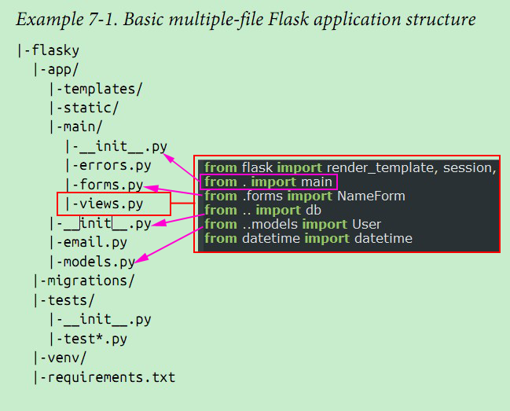


> 这里记录一些与Python相关的第一次知道的，或一直理解错的。

* print()
    * 一直用的是python2.x，打印输出直接 `print something`
    * 刚知道可以`print(*objects, sep=' ', end='\n', file=sys.stdout) `可以将内容输出到文件
    * 而在python2.x中使用，则很可能被当做一个**关键词**，而不是一个**语句**从而出错，解决办法：在开始使用语句：`from __future__ import print_function`
    * 或在python2.x中，使用`print >>filename, 'something'`
    * 另：使用`help(__builtins__)`可以查看一些内置函数的帮助，但`print`这个在python2.x中却帮了倒忙。

    
* sys.stdout, sys.stdin
	* sys.stdout与print 
		* 当我们在 Python 中打印对象调用 print obj 时候，事实上是调用了 sys.stdout.write(obj+'\n')
		* print 将你需要的内容打印到了控制台，然后追加了一个换行符
		* print 会调用 sys.stdout 的 write 方法
		* 以下两行在事实上等价：
			* `sys.stdout.write('hello'+'\n') `
			* `print 'hello'`
	
	* sys.stdin 与 raw_input
		* 当我们用 raw_input('Input promption: ') 时，事实上是先把提示信息输出，然后捕获输入
		* 以下两组在事实上等价：
			* `hi=raw_input('hello? ') `
			* `print 'hello? ', #comma to stay in the same line `
			* `hi=sys.stdin.readline()[:-1] # -1 to discard the '\n' in input stream`
	* 引自：[ Python的sys.stdout、sys.stdin重定向](http://blog.csdn.net/sxhlovehmm/article/details/41479005)
	
* raw_input() 与 input()
	* raw_input() 	-- python 2.x
	* input() 			-- python 3.x
	
* Check Python in 32 bit mode
	```
		>>> import sys, platform
		>>> platform.architecture()
		('64bit', 'WindowsPE')
		>>> sys.maxint
		2147483647				# 64bit: 9223372036854775807
		[Ref](http://stackoverflow.com/questions/3411079/why-does-the-python-2-7-amd-64-installer-seem-to-run-python-in-32-bit-mode)
	```
    
* SQL,
    * `INSERT OR IGNORE INTO` 忽略重复数据的插入
    * `INSERT OR REPLACE INTO ` 如果该行不存在，则插入；如果存在，则替换之
        * 这比`UPDATE`要好一些：因为当该行不存在时，则`UPDATE`不会有任何操作
	
* buffer(), memoryview()
	* buffer()用在2.x，memoryview()用在python3(python 2.7中也添加了此用法)
	* 在使用很大的数据时，应该使用此函数
	* 作用：引用了支持buffer/memoryview的对象（如string）的一个切片，但不占用额外的内存空间
	* 示例：gs
		```
			>>> s = 'Hello world'
			>>> t = buffer(s, 6, 5)
			>>> t
			<read-only buffer for 0x10064a4b0, size 5, offset 6 at 0x100634ab0>
			>>> print t
			world
			
			>>> s = 'Hello world'
			>>> t = memoryview(s)
			>>> t
			<memory at 0x0000000002CE3438>
			>>> print t[6:].tobytes()
			world			
		
		```
	* [What is Python buffer type for?](http://stackoverflow.com/questions/3422685/what-is-python-buffer-type-for)
    
    
* BeautifulSoup()
    * You can add, remove, and modify a tag’s attributes. Treat the tag as a dictionary.
        ```
            tag['class'] = 'verybold'
            tag['id'] = 1
            tag
            # <blockquote class="verybold" id="1">Extremely bold</blockquote>

            del tag['class']
            del tag['id']
            tag
            # <blockquote>Extremely bold</blockquote>

            tag['class']
            # KeyError: 'class'
            print(tag.get('class'))
            # None        
        ```
    * tag_wrap = soup.find('div', class_='wrapper')
    * tag_wrap = soup.find_all('li')
    
* try...except...finally...raise,  [python try/except/finally](http://blog.csdn.net/spch2008/article/details/9343207#)
    *  try不仅捕获异常，而且会恢复执行
    ```
        def catcher():
            try:
                fetcher(x, 4)
            except:
                print "got exception"
            print "continuing"    
    ```
    
    * 无论try是否发生异常，finally总会执行
    
    ```
        def catcher():
            try:
                fetcher(x, 4)
            finally:
                print 'after fecth'    
    ```
    
    *  try无异常，才会执行else
    ```
        def catcher():
            try:
                fetcher(x, 4)
            except:
                print "got exception"
            else:
                print "not exception"    
    ```
    > else作用：没有else语句，当执行完try语句后，无法知道是没有发生异常，还是发生了异常并被处理过了。通过else可以清楚的区分开。
    
    *  利用raise传递异常
    ```
        def catcher():
            try:
                fetcher(x, 4)
            except:
                print "got exception"
                raise    
    ```
    > raise语句不包括异常名称或额外资料时，会重新引发当前异常。如果希望捕获处理一个异常，而又不希望
异常在程序代码中消失，可以通过raise重新引发该异常。

    *  except(name1, name2)
    ```
        def catcher():
            try:
                fetcher(x, 4)
            except(TypeError, IndexError):
                print "got exception"
            else:
                print "not exception"
    ```
    > 捕获列表列出的异常，进行处理。若except后无任何参数，则捕获所有异常。
    
    
* 执行Python的CGI脚本
    * （Common Gateway Interface）在这里是指一种基于浏览器的输入、在Web服务器上运行的程序方法
    * CGI脚本使你的浏览器与用户能交互.这个脚本通常象服务器和系统中其他程序如数据库的桥梁。
    * 首先考虑到nginx作为web server
    * 但据说，原生Nginx不能直接执行外部CGI程序，因此需要依赖spawn-fcgi来执行
    
* Command-line arguments
    * The list of command line arguments passed to a Python script. 
    * argv[0] is the script name (it is operating system dependent whether this is a full pathname or not). 
    
```
    import sys

    print sys.argv
    for arg in sys.argv:
        print arg
        
    fname = sys.argv[1]
    fh = open(fname, 'r')
    text = fh.read()
    print fname, len(text)
```

* `os.popen(cmd)`
    * *cmd* is a shell command.
    * The return value is a file pointer that behaves just like an open file.
    * You can read the output one line at a time with `readline()` or get the whole thing at once with `read()`
    ```
        import os
        
        cmd = 'ipconfig/all'
        cp = os.popen(cmd)
        print cp.read()
    
    ```
    
* Paths
    * relative path : A string that describes where a file or directory is stored relative to the current working directory.
    * absolute path : A string that describes where a file or directory is stored that starts at the "top of the tree of directories" .
    * current working directory: The current working directory that you are **in**.

* Python System Path for Windows
    * PATH=PATH;c:\python27 => 可以在cmd中打开python shell，或使用`python file.py`来运行python程序
        * 注意：后面不要加上反斜线 (\)
    * PATH=PATH;c:\Python27\Scripts; => 可以在CMD里直接运行 *ipython* 和 *pip*
    * PATHEXT=PATHEXT;.PY;.PYM => 可直接运行.py程序
        * 配置这个之后，导致没有办法直接从cmd进入python shell，也没有办法打开ipython，
        * 带来很多不方便，最后决定还是去掉了。
        
* pip update
    * Windows : `python -m pip install --upgrade pip`
    * Linux : `pip install update pip`
    
## Lists

### List Comprehension

* return a list by its even items
    ```
    >>> l = list(range(0, 20))
    >>> l
    [0, 1, 2, 3, 4, 5, 6, 7, 8, 9, 10, 11, 12, 13, 14, 15, 16, 17, 18, 19]
    >>> [x for x in l if (l.index(x) % 2 == 0)]
    [0, 2, 4, 6, 8, 10, 12, 14, 16, 18]
    
    ```

### list other
* Reverse a List:   `['a', 1, '2', 'c'][::-1]`
    * The are seven sequence types: strings, Unicode strings, lists, tuples, bytearrays, buffer, and xrange objects.
    * The sequence operations sorted in ascending priority:
        1 `x in s`  `2 in [1, 2, 3]`
        2 `x not in s`  `4 not in [1, 2, 3]`
        3 `s + t`  `'hello' + 'world'`
        4 `s * n` or `n * s`  `'hello ' * 5`
        5 `s[i]`  `'hello'[2]`
        6 `s[i:j]`  `'hello'[1:2]`
        7 `s[i:j:k]`  `'hello'[::-1]`
        8 `len(s)`  `len('hello')`
        9 `min(s)`  `min([2, 3, 'a', 55])`
        10 `max(s)`  `max([2, 3, 'a', 55])`
        11 `s.index(x)`  `[2, 3, 'a', 55].index('a')`
        12 `s.count(x)`  `[2, 3, 'a', 55].count('a')`

* Parameters and Arguments
    * *parameter* ( *formal *parameter  ) : refers to the variable as found in the function definition
    * *argument* ( *actual *parameter ) : refers to the actual input passed
    * example:
        * We defines a *add* function as `def add(x, y): return x + y`, then *x, *y are parameters
        * While if this is called as add(2, 3), then *2 *3 are arguments
    * [Parameter (computer programming)](https://en.wikipedia.org/wiki/Parameter_%28computer_programming%29#Parameters_and_arguments)
    
* Function definitions: `arg`,  `*args`, `**kwargs`
    * `arg` is the standard format for defining a function, except for one argument.
    * `*args`, `**kwargs`  allow you to pass a variable number of arguments to a function.
    * `*args`, one star , except for a single tuples, 
    * `**kwargs`, two stars, is a dictionary, except for passing key/value pairs.
    * examplse:
        ```
            # first with *args
            >>> args = ("two", 3,5)
            >>> test_args_kwargs(*args)
            arg1: two
            arg2: 3
            arg3: 5

            # now with **kwargs:
            >>> kwargs = {"arg3": 3, "arg2": "two","arg1":5}
            >>> test_args_kwargs(**kwargs)
            arg1: 5
            arg2: two
            arg3: 3
            
            #####
            def nostar(a): print a

            def onestar(*a): print a

            def twostar(**a): print a
            
            >>> nostar(1)
            1
            >>> nostar(1, 2)

            Traceback (most recent call last):
              File "<pyshell#38>", line 1, in <module>
                nostar(1, 2)
            TypeError: nostar() takes exactly 1 argument (2 given)
            >>> nostar('a')
            a
            >>> onestar(1)
            (1,)
            >>> onestar(1, 2, 3, 4)
            (1, 2, 3, 4)
            >>> onestar(1, 2, 3, 'a', 'dd')
            (1, 2, 3, 'a', 'dd')
            >>> twostar(1, 2, 3)

            Traceback (most recent call last):
              File "<pyshell#43>", line 1, in <module>
                twostar(1, 2, 3)
            TypeError: twostar() takes exactly 0 arguments (3 given)
            >>> twostar(a=1)
            {'a': 1}
            >>> twostar(a=1, tom=3)
            {'a': 1, 'tom': 3}      

        
        ```
    * The three forms can be combined as follows:
    ```
        >>> def all_in_one(a, *b, **c): print a, b, c

        >>> all_in_one(1, 2, 3, 4, 'tom', 'jery', x=6, y=7, z=8, word='dev')
        1 (2, 3, 4, 'tom', 'jery') {'y': 7, 'x': 6, 'z': 8, 'word': 'dev'}

    ```
    * What is the difference between the following calls?
        * `test(x)`
        * `test(*x)`
        * `test(**x)`
    * Here it is:
        * `test(x)` : the function must be defined with one argument
        * `test(*x)` : **x** must be a squence (list, tuple, etc), and the function must be defined with many arguments
        * `test(**x)` : **x** must be a dictionary of key/value pairs, and the function must be defined with many pairs as the arguments.
        
        ```
            >>> def test(a, b, c): print a, b, c

            >>> test(1, 2, 3)
            1 2 3
            >>> x = (1, 2, 3)
            >>> test(x)

            Traceback (most recent call last):
              File "<pyshell#53>", line 1, in <module>
                test(x)
            TypeError: test() takes exactly 3 arguments (1 given)
            >>> test(*x)
            1 2 3
            >>> test(**x)

            Traceback (most recent call last):
              File "<pyshell#55>", line 1, in <module>
                test(**x)
            TypeError: test() argument after ** must be a mapping, not tuple
            >>> x = {'a':1, 'b':2, 'c':3}
            >>> test(**x)
            1 2 3
            >>> test(*x)
            a c b
        
        ```
    
    * [Passing arguments to Python functions](https://rverzola.wordpress.com/2009/02/20/passing-arguments-to-python-functions/)
    
    
* [4 Command-line tools for more Python productivity](http://pythontips.com/2015/06/21/4-command-line-tools-for-more-python-productivity/#more-639)
    * IPython
    * Autoenv
    * Cookie Cutter
    * Bash Git Prompt
    
* Floor Division
    
    ```
    temp_Fahrenheit = 212

    temp_Celsius = 5.0 / 9.0 * (temp_Fahrenheit - 32)

    print temp_Celsius
    
    ```
    * Don't use `5 / 9 *  (temp_Fahrenheit - 32)`
    
    ```
    >>> 59 / 60
    0
    ```
    * When both of the operands are integers, the result is also an integer; floor division chops off the fractional part, so in this example it truncates the answer to zero.
    ```
    >>> 59.0 / 60
    0.9833333333333333
    >>> 59 / 60.0
    0.9833333333333333
    ```
    * If either of the operands is a float-point number, Python performs floating-point division, and the result is a float:
    


* Explain Variables:
    1. `price = 100`
    2. `price = 100 + 1     # price add one`
    3. `price = price + 1     # price add one`
    4. `price += 1     # price add one`
    
* Choosing mnemonic variable names
    * Read the following three programs and try to understand them:
    ```
    a = 35.0
    b = 12.50
    c = a * b
    print c
    
    
    hours = 35.0
    rate = 12.50
    pay = hours * rate
    print pay
    
    
    x1q3z9ahd = 35.0
    x1q3z9afd = 12.50
    x1q3z9afd = x1q3z9ahd * x1q3z9afd
    print x1q3z9afd
    
    ```
    
* The modulus operator `%`
    * `>>> 7 % 3  # return 1`
    * Check whether one number is divisible by another.
        * ` if x % y == 0: print "Divisible" `
    * Extract the right-most digit or digits from a number.
        * ` x % 10 ` yields the right-most digit of x (in base 10).
        * `x % 100` yields the last two digits.
    
* `python -i test.py` : interactive mode

* download file with Python
    * reference : [Python 101: How to Download a File](http://www.blog.pythonlibrary.org/2012/06/07/python-101-how-to-download-a-file/)
    * Python 2 code
        * Using requests
            ```
            import requests
            r = requests.get(url)
            with open("FILENAME.EXT", "wb") as code:
                code.write(r.content)            
            ```
            
        * Using urllib
            ```
            import urllib
            urllib.urlretrieve(url, "FILENAME.EXT")            
            ```
        * Using urllib2
            ```
            import urllib2
            f = urllib2.urlopen(url)
            with open("FILENAME.EXT", "wb") as code:
                code.write(f.read())
            ```
    * Python 3 code
        * Using requests
            ```
            import requests
            r = requests.get(url)
            with open("FILENAME.EXT", "wb") as code:
                code.write(r.content)            
            ```
            
        * Using urllib.request
            ```
            import urllib.request, urllib.parse, urllib.error
            urllib.urlretrieve(url, "FILENAME.EXT")            
            ```
        * Using urllib2 (urllib2 no longer EXISTS)
            ```
            import urllib.request, urllib.parse, urllib.error
            f = urllib.request.urlopen(url)
            data = f.read()
            with open("code2.zip", "wb") as code:
                code.write(data)
            ```
* Test for performance, code for maintainability.

## Lists

* [Quick way to compare two python lists](http://appcrawler.com/wordpress/2010/10/22/quick-way-to-compare-two-python-lists/)
    * Using List comprehension
        ```
        >>> a=[1,3,5]
        >>> b=[1,2,3,4,5,6]
        >>> print [c for c in b if c not in a]
        [2, 4, 6]
        >>>
        
        ```
    * Using For Loop
        ```
        >>> for c in b:
        ...   if c not in a:
        ...     print c
        ...
        2
        4
        6
        >>>        
        ```

    
* Python get USER Directory
    ```
        >>> import os
        >>> os.path.expanduser('~')
        'C:\\Users\\ixing'
        >>> os.environ['HOME']
        'C:\\Users\\ixing'
        >>> os.path.expandvars('$HOME')
        'C:\\Users\\ixing'
        >>> os.getenv('HOME')
        'C:\\Users\\ixing'
        >>> os.path.expanduser('~user')
        'C:\\Users\\user'    
    ```
    
* Profiling
    * cProfile
    * profile
    * hotshot


    
* Unpacking values from a tuple
    * `people = ('Bob', '23', 'Software')`
        * `name, age, work = people`

    
* About encode & decode
    * [Python字符编码详解](http://www.cnblogs.com/huxi/archive/2010/12/05/1897271.html)
        * 该博主的其他几篇与Python有关的文章也非常值得一读
    * [Python Unicode与中文处理](http://blog.csdn.net/dao123mao/article/details/5396497)
    * [谈谈Unicode编码，简要解释UCS、UTF、BMP、BOM等名词](http://www.pythonclub.org/python-basic/encode-detail)
    * [http://www.pythonclub.org/python-basic/encode-detail](http://blog.csdn.net/backard/article/details/9124227)
    * []()
    
* move file
    * Using os.rename
        `os.rename(src, dst)`
    * Using shutil.move
        `shutil.move(src, dst)`
        
* Regex Expressions
    * re.search(pattern, string, flags=0)
        * looking for the first location for the match
        ```
        >>> import re
        >>> m = re.search('(?<=abc)def', 'abcdef')
        >>> m.group(0)
        'def'
        
        
        ```
    * re.match(pattern, string, flags=0)
        * only match at the beginning of the string
        * if match, return a *MatchObject* instance.
        * Return *None* if the string does not match the pattern.
        
        ```
        >>> m = re.match(r"(\w+) (\w+)", "Isaac Newton, physicist")
        >>> m.group(0)       # The entire match
        'Isaac Newton'
        >>> m.group(1)       # The first parenthesized subgroup.
        'Isaac'
        >>> m.group(2)       # The second parenthesized subgroup.
        'Newton'
        >>> m.group(1, 2)    # Multiple arguments give us a tuple.
        ('Isaac', 'Newton')
        
        ```
        
    * re.split(pattern, string, maxsplit=0, flags=0)
        * Split string by the occurrences of pattern.
        
        ```
        >>> re.split('\W+', 'Words, words, words.')
        ['Words', 'words', 'words', '']
        >>> re.split('(\W+)', 'Words, words, words.')
        ['Words', ', ', 'words', ', ', 'words', '.', '']
        >>> re.split('\W+', 'Words, words, words.', 1)
        ['Words', 'words, words.']
        >>> re.split('[a-f]+', '0a3B9', flags=re.IGNORECASE)
        ['0', '3', '9']        
        ```
    * re.findall(pattern, string, flags=0)
        * Return all non-overlapping matches of pattern in string, as a list of strings. 
        
    * re.sub(pattern, repl, string, count=0, flags=0)
        * Return the string obtained by replacing the leftmost non-overlapping occurrences of pattern in string by the replacement repl.

* CodeSkulptor  Viz Mode -- Visualizing functions
    * [CodeSkulptor Viz mode](http://www.codeskulptor.org/viz/index.html)
    
* The remainder is *%*
    * remainder ?
        ```
        >>> 10 % 3
        1        
        ```
    * Computes 12 / 24 hour use *%*
    
        ```
        hour = 24
        shift = 8
        print (hour + shift) % 24   # 4
        ```
    * screen wraparound
        ```
        width = 800
        position = 797
        move = 5
        position = (position + move) % width
        print position
        
        ```
* `dir()` - lists the methods available for an object.

    ```
        >>> s = 'hello'
        >>> dir(s)
        ['__add__', '__class__', '__contains__', '__delattr__', '__doc__', '__eq__', '__format__', '__ge__', '__getattribute__', '__getitem__', '__getnewargs__', '__getslice__', '__gt__', '__hash__', '__init__', '__le__', '__len__', '__lt__', '__mod__', '__mul__', '__ne__', '__new__', '__reduce__', '__reduce_ex__', '__repr__', '__rmod__', '__rmul__', '__setattr__', '__sizeof__', '__str__', '__subclasshook__', '_formatter_field_name_split', '_formatter_parser', 'capitalize', 'center', 'count', 'decode', 'encode', 'endswith', 'expandtabs', 'find', 'format', 'index', 'isalnum', 'isalpha', 'isdigit', 'islower', 'isspace', 'istitle', 'isupper', 'join', 'ljust', 'lower', 'lstrip', 'partition', 'replace', 'rfind', 'rindex', 'rjust', 'rpartition', 'rsplit', 'rstrip', 'split', 'splitlines', 'startswith', 'strip', 'swapcase', 'title', 'translate', 'upper', 'zfill']    
    ```
* `help(str.count)`
    
    ```
        >>> help(str.count)
        Help on method_descriptor:

        count(...)
            S.count(sub[, start[, end]]) -> int
            
            Return the number of non-overlapping occurrences of substring sub in
            string S[start:end].  Optional arguments start and end are interpreted
            as in slice notation.
    
    ```
    
* `type()` - show the type of an object
    ```
        >>> s = 'hello'
        >>> print type(s)
        <type 'str'>
    
    ```
    
* Run a python script in a Unix-like system
    * Method 1: call the interpreter program with the path to the script passed as an argument.
        `$ python script.py`
    * Method 2: run your script as a standalone executable: `./script.py`
        * In order to do this, you need to:
            * Make sure execute permissions are turned on ( `$ chmod a+x script.py` )
            * Start the first line in the script with the symbols `#!` ( called a "shebang")followed by the path to the interpreter to use.
            
* `string.punctuation`
    * 
        ```
        >>> import string
        >>> string.punctuation
        '!"#$%&\'()*+,-./:;<=>?@[\\]^_`{|}~'
        ```
* translate(s, table, deletions='')
    * 
    ```
        import string
        'abc!334d.'.translate(None, string.punctuation)
    ```

* Using tuples as keys in dictionaries
    * If we want to create a composite key to use in a dictionary we must use a tuple as the key.
        * `yellowpage[lastname, firstname] = number`
    * To traverse this dictionary
        ```
            for lastname, firstname in yellowpage:
                print firstname, lastname, yellowpage[lastname, firstname]
        ```
    
* Coding Style
    * Use 4-spaces indentation, and no tabs
    * Wrap lines so that they don't exceed 79 characters.
    * Use blank lines to separate functions and classes, and larger blocks of code inside functions
    * When possible, put comments on a line of their own.
    * Use docstrings
    * Use spaces around operators and after commas, but not directly inside bracketing constructs.
    * Name your classes and functions consistently
        * Use `CamelCase` for classes
        * Use `lower_case_with_underscores` for functions and methods
        * Always use `self` as the name for the first method argument.
    
* Construct a full (“absolute”) URL
    * by combining a “base URL” (base) with another URL (url).
    * `urlparse.urljoin(base, url[, allow_fragments])`
    * exs:
        * ex1
            ```
            >>> from urlparse import urljoin
            >>> urljoin('http://www.cwi.nl/%7Eguido/Python.html', 'FAQ.html')
            'http://www.cwi.nl/%7Eguido/FAQ.html'
            
            ```
        * ex2:
            ```
            >>> from urlparse import urlparse
            >>> base_url = 'http://www.dmoz.org/Computers/Programming/Languages/Python'
            >>> url = '/Computers/Programming/Languages/Python/Web/'
            >>> import urlparse
            >>> urlparse.urljoin(base_url, url)
            'http://www.dmoz.org/Computers/Programming/Languages/Python/Web/'            
            ```
        * If url is an absolute URL (that is, starting with // or scheme://) , the url‘s host name and/or scheme will be present in the result. For example::
            ```
            >>> urljoin('http://www.cwi.nl/%7Eguido/Python.html',
            ...         '//www.python.org/%7Eguido')
            'http://www.python.org/%7Eguido'
            
            ```
        * If you do not want that behavior, preprocess the *url* with `urlsplit()` and `urlunsplit()`, remove possible scheme and net1oc parts.
        
* exit
    * Python program exit:
        ```
            import sys
            
            ...
            sys.exit(0)     `# normal exit`
            
        ```
        
* `urlparse.parse_qsl` : query string to list
    ```
        >>> qs = 'action=pushing&category=Books'
        >>> import urlparse
        >>> urlparse.parse_qsl(qs)
        [('action', 'pushing'), ('category', 'Books')]
        >>> dict(urlparse.parse_qsl(qs))
        {'action': 'pushing', 'category': 'Books'}  
        >>> urlparse.parse_qs(qs)
        {'action': ['pushing'], 'category': ['Books']}    
    ```
    * *parse_qs* : return dictionary
    * *parse_qsl* : return list, query string to list
    
* *expression* means "something", while statement means "do something"
    * An expression can do something if it includes a function call.
* *exec* is for statement and does not return anything
* *eval* is for expression and returns value of expression.    `


## Some Modules

### Copy

* copy.copy(x): Shallow cpy.
* copy.deepcopy(x, memo=None, _nil=[]) : Deep copy function deepcopy.

### keyword

* keyword.iskeyword('if')
* keyword.kwlist
    ```
    >>> keyword.iskeyword('if')
    True
    >>> keyword.iskeyword('iff')
    False
    >>> keyword.kwlist
    ['and', 'as', 'assert', 'break', 'class', 'continue', 'def', 'del', 'elif', 'else', 'except', 'exec', 'finally', 'for', 'from', 'global', 'if', 'import', 'in', 'is', 'lambda', 'not', 'or', 'pass', 'print', 'raise', 'return', 'try', 'while', 'with', 'yield']
    
    ```
    
### Random

* random.randint(1, 100)
* random.choice(['a', 'Jack', 'Python', 34])
* random.shuffle(['a', 'Jack', 'Python', 34])

### sys

* sys.exit()
* sys.stdin.readline()
    * sys.stdin.readline(8)
* sys.stdout.write('some thing you want to write to console')
* sys.version
    ```
    >>> sys.version
    '2.7.10 (default, May 23 2015, 09:44:00) [MSC v.1500 64 bit (AMD64)]'
    ```
    
### time

* time.time()
    ```
    import time
    t1 = time.time()
    # do something
    t2 = time.time()
    
    print "It took %s seconds." % (t2 - t1)
    
    ```
    
* time.asctime() : Converting a Date with asctime
    ```
        >>> time.asctime()
        'Sun Feb 28 22:43:56 2016'
        >>> t = (2016, 2, 20, 10, 34, 52, 6, 0, 0)
        >>> time.asctime(t)
        'Sun Feb 20 10:34:52 2016'    
        
        
    ```

* time.localtime()    
    ```
    >>> time.localtime()
    time.struct_time(tm_year=2016, tm_mon=2, tm_mday=28, tm_hour=22, tm_min=48, tm_sec=19, tm_wday=6, tm_yday=59, tm_isdst=0)
    >>> t = time.localtime()
    >>> print "year: %s" % t[0]
    year: 2016
    >>> print "month: %s" % t[1]
    month: 2
    
    ```
* time.sleep(1)
    * time.sleep(1) : program pause 1 second.
    
### Use the pickle Module to Save Information

* pickle.dump(data, file)
* pickle.load(file)

    ```
        >>> import pickle
        >>> data = {
            'player': 'David',
            'level' : 23,
            'pockets' : ['keys', 'pocket knife'],
            }
        >>> save_file = open('some.txt', 'wb')
        >>> pickle.dump(data, save_file)
        >>> save_file.close()
        >>> load_file = open('some.txt', 'rb')
        >>> load_data = pickle.load(load_file)
        >>> load_file.close()    
    ```
    
    
    
* 在写Windows 文件名之前，将字符串中的特殊字符去除
    ```
    import re
    
    def pretty_windows_filename(filename):
        """clean the file name for winodws"""
        
        pattern = r'[\\/:*?"<>|]'       # strip special chars for windows filename
        filename = re.sub(pattern, ' ', filename)
        return filename

    
    ```

* 将迅雷地址转换成普通链接
    * 迅雷地址使用的是base64来加密的
    * 在真实地址前面加上AA，后面加上ZZ
    * 
    ```
        import base64
        
        href = "thunder://QUFodHRwOi8vZGwzMi44MHMuaW06OTIwLzE2MDMv5Y+26ZeuM1vnsqTor63niYhdL+WPtumXrjNb57Kk6K+t54mIXV9iZC5tcDRaWg=="
        
        href = base64.b64decode(href[10:])[2:-2]
        print href
    
    ```
    
* Python import path:
    * 
    
    
* PYTHON os.environ
    * display os.environ keys
        ```
            $ import os
            $ os.environ.keys()            
        ```
    
    * for Windows :
        * display all the virables: `set`
        * display env virable: `set VIRABLE`
        * modify env variable: `set VIRABLE='something'`
        * append : `set VIRABLE=%VIRABLE%;'some_new_things'`
    
* python @staticmethod vs @classmethod
    [Difference between @staticmethod and @classmethod in Python](http://pythoncentral.io/difference-between-staticmethod-and-classmethod-in-python/)
    

* conda :  
    * [Conda Docs](http://conda.pydata.org/docs/)
    * `$ conda list`
    * `$ conda install `
    * `$ conda create -n venv python=3.4.3 other_packages`
        * 会在 *Anaconda* 安装目录下创建名称为 *venv* 这个虚拟环境
    * `$ conda install -n venv some_packages`
        * 向 虚拟环境 *venv* 中安装软件
        
    * `$ source activate venv`
        * Windows: `$ activate venv`
    * `$ source deactivate`        
        * Windows: `$ deactivate`
        
    * `$ conda create --name flowers --clone snowflakes`
    * `$ conda remove --name flowers --clone snowflakes`
    * List all environments:
        `$ conda info --envs`
    * Verify current environment:
        `$ conda info --envs`
        `root       *   /opt/conda`
        * the current environment with an *-*-*.
    * `$ conda env list`
    * Check Python versions:
        `$ conda search python`
    * Install a different version of Python:
        `$ conda create --name snakes python=3`
        
        
        
        
